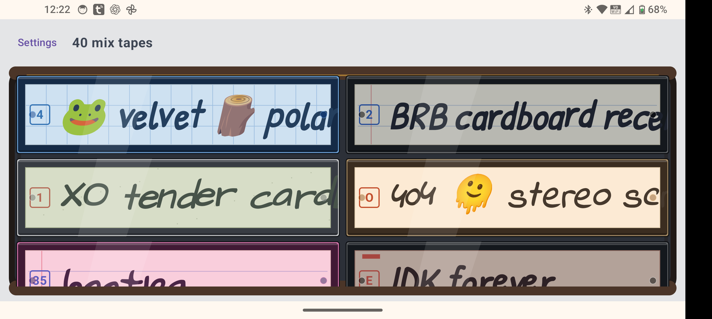

# Android Mixtape

Android Mixtape turns the music stored on your device into a case full of virtual mixtapes. It groups local tracks into tape-sized collections, gives each one a memorable name, and presents playback through customizable cassette decks, cases, sleeves, labels, stickers, and handwritten track lists.

Everything runs locally. The app reads audio through Android's media library and does not upload your music or require an online account.

The modern build targets Android 16. Returning from system settings refreshes audio permission; revoking access clears the inaccessible library and playback queue.

## Highlights

- Automatically groups local music into mixtapes.
- Opens on the full-page tape library when idle, or returns to the player when music is already playing.
- Chooses names from a bundled collection of 1,714 mixtape names, with manual editing and rerolling available.
- Uses a fully native Compose cassette UI with 11 decks (including Graphite Tall), 26 shells, 24 stickers, 13 case finishes and 38 linked sleeve/spine designs.
- Shows area-conserving tape windings, animated hubs, real stereo meters and mechanical or digital counters.
- Keeps six large transport keys inside the player, with the same player proportions in portrait and landscape.
- Uses the same translucent plastic and paper design for a tape’s spine and title-only track list.
- Keeps each mixtape's name and visual design stable between launches.
- Lets oversized single-line names run to the paper edge, with occasional boxed catalogue codes for a hand-labelled cassette feel.
- Offers configurable handwriting messiness: **High**, **Low**, or **Off**.
- Uses **Blackout Portable** as the initial deck on devices in dark mode and **Silverface Hi-Fi** in light mode.
- Includes native playback controls and tap-to-play track selection, with track actions on long press.
- Supports Android Auto through the modern build.
- Keeps emoji and punctuation intact in handwritten labels.

## Compatibility

Android Mixtape requires Android 7.0 or newer, with the full Compose interface, Media3 playback, and Android Auto support. The legacy Android 4.4 variant has been retired.

## Getting started

1. Install the Mixtape APK.
2. Open **Mixtape** and grant access to audio files when prompted.
3. The app scans music already indexed by Android and creates your mixtapes.
4. Browse the full-page library in one column in portrait or two columns in landscape. Open a tape to view its tracks and use the deck controls.
5. Tap the **double-arrow/gear** key to switch between tracks and the tape shelf. The shelf keeps the current tape visible, centering it when space allows without blank gaps at either end; choosing a tape returns to its tracks.
6. Hold that key to open **Settings**, or use the gear in a tape’s editor. Long-press any spine or the loaded cassette, or tap its current spine, to customize that tape.
7. Roll the dice at the top of the tape editor for a fresh name and spine/case design. Preview as many as you like; **Save** applies the draft and **Cancel** keeps your existing tape.
8. Use Settings to change grouping, handwriting size, names, visual themes, and filename exclusions. Each tape also has its own text alignment, symbol position, optional printed code and separate lettering/symbol colours, adjustable in its customizer.

If no music appears, place supported audio files in the device's Music folder and ask Android or your media app to rescan them.

## Privacy

Android Mixtape operates on local media. It does not contain an AI model, use an online naming service, or send track information to a remote service.

## License

Android Mixtape is available under the [MIT License](LICENSE).

## Screenshots

### Mixtape case

### Portrait player

### Landscape player

